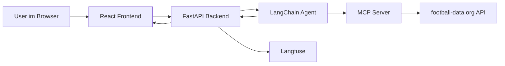

# BetRegret

BetRegret ist ein Fussball-Chatbot, der Fragen zu Teams, Ligen, Fixtures, Live-Spielen und Wettprognosen beantwortet.

## Ziel des Projekts

Das Ziel ist ein Fussball-Assistent, der möglichst nah an echten Daten arbeitet und nicht einfach freie Antworten erfindet. Der Bot soll:

- Fussballfragen mit aktuellen Daten beantworten
- Informationen zu Teams, Ligen und Spielen finden
- Vorhersagen auf Basis nachvollziehbarer Signale berechnen
- bei Unsicherheit sagen, warum eine Frage nicht sauber mit den vorhandenen Tools beantwortbar ist
- den gesamten Chatverlauf fuer Folgefragen behalten
- den Weg von der Nutzerfrage bis zur Antwort nachvollziehbar machen

## Gesamtidee und Architektur



Der Ablauf ist:

1. Der User schreibt eine Nachricht im Frontend.
2. Das Frontend sendet den kompletten Chatverlauf an das Backend.
3. Das Backend wandelt den Verlauf in LangChain-Messages um.
4. Der Agent entscheidet, welches Tool er braucht.
5. Der MCP-Server spricht mit der football-data.org API.
6. Die Antwort aus dem Tool geht zurück an den Agenten.
7. Der Agent formuliert daraus die Antwort.
8. Das Backend hngt die Laufzeit an und gibt die Antwort an das Frontend zurück.

Langfuse zeichnet dabei die Agentenläufe und Tool-Nutzung auf.

## Wie die Komponenten zusammenarbeiten

Das Projekt hat drei klare Ebenen:

- das Frontend
- das Backend
- den MCP-Server fuür die eigentlichen Fussballdaten

## Frontend
`App.js` verwaltet:

- den Chatverlauf
- das Eingabefeld
- den Ladezustand
- den Request an das Backend

Bei jeder neuen Nachricht wird der bisherige Verlauf mitgeschickt. Dadurch kann der Bot Folgefragen im Kontext verstehen.

`Chatview.jsx` zeigt die Nachrichten an.

`Chatfield.jsx` stellt das Eingabefeld und den Send-Button bereit.

`AIMessage.jsx` rendert die Modellantworten und unterstuetzt einfache Formatierungen wie Zeilenumbrueche, Listen, Bilder und Hervorhebungen.

`MessageLoader.jsx` zeigt den Ladezustand. Das Fussballsymbol ist lokal gespeichert unter `frontend/src/assets/football.png` und wird nicht extern geladen.


## Backend
Wichtige Datei:

- `backend/main.py`

### Aufgaben von `main.py`

`main.py`:

- startet FastAPI
- baut den LangChain-Agenten
- bindet den MCP-Server über `MultiServerMCPClient` ein
- akzeptiert den Chatverlauf als Request
- ruft den Agenten auf
- hängt die Antwortzeit an
- sendet Langfuse-Callbacks
- fängt Kontext-Overflow ab
- prüft tool-freie Antworten mit einem Guard

Der Agent ist so konfiguriert, dass er die Tools zuerst nutzen soll. Erst wenn die Tools keine Antwort liefern können, darf er auf internes Fussballwissen ausweichen.

## MCP-Server und football-data.org

Der MCP-Server liegt in `backend/soccer-mcp-server/soccer_server.py`.

Er kapselt die football-data.org API und stellt dem Agenten klar benannte Tools bereit. Der Agent spricht nicht direkt mit der API, sondern nur mit dem MCP-Server. Das macht das System sauberer und kontrollierbarer.

### Warum der MCP-Server nötig war

Ursprünglich war das Projekt nicht direkt auf football-data.org ausgerichtet. Damit es mit der API funktioniert, mussten mehrere Dinge angepasst werden:

- neue Endpunkte
- neue Datenstrukturen
- die Logik für `season`
- Teamnamens-Normalisierung
- Fehler- und Rate-Limit-Verhalten
- Vorhersagelogik hinzugefügt

### Teamnamen normalisieren

Der Benutzer schreibt Teamnamen oft anders als die API es versteht. Darum normalisiert der Server Namen, entfernt Sonderzeichen und gleiche Bedeutungstragende Kürzel. So werden zum Beispiel verschiedene Schreibweisen besser zusammengefuehrt.

### Retry und Rate Limits

Der Server reagiert robuster auf API-Fehler und Rate Limits. Bei 429-Antworten wird erneut versucht, statt sofort aufzugeben.

### Cache

Im MCP-Server gibt es mehrere In-Memory-Caches:

- `TEAM_SEARCH_CACHE`
- `COMPETITIONS_CACHE`
- `TEAM_ID_CACHE`
- `TEAM_FULL_DATA_CACHE`
- `STANDINGS_DATA_CACHE`

Der Cache spart Zeit, weil wiederholte API-Aufrufe innerhalb derselben Server-Session vermieden werden. Er lebt nur im Speicher und ist nach einem Neustart der Website leer.

## Das Wettentool

Die Funktion `predict_match_outcome` in `backend/soccer-mcp-server/soccer_server.py` bewertet ein Spiel zwischen zwei Teams.

Das Tool liefert:

- ein erwartetes Ergebnis
- Wahrscheinlichkeiten fuer Heimsieg, Unentschieden und Auswaertssieg
- eine Empfehlung
- eine nachvollziehbare Analyse

Die Vorhersage nutzt diese Signale:

- aktuelle Ligadaten aus der Tabelle
- Punkte pro Spiel
- Tordifferenz
- Tore fuer und gegen
- Heimvorteil

Das Ergebnis ist bewusst einfach gehalten. Es soll keine Blackbox sein, sondern eine kompakte Einschaetzung, die der Chatbot direkt erklaeren kann.

## Guard, Sicherheit und Fehlertoleranz

BetRegret soll möglichst toolbasiert arbeiten. Gleichzeitig braucht das System Schutz, wenn die Tools für eine Frage nicht ausreichen und die AI die Informationen in dem internen Wissen sucht. Dafür gibt es aber ein LLM-as-a-Guard, welche die Antwort der AI überprüft ob sie Fussball relevant ist. So wird vermieden das der User die AI Jailbreaken kann.

### Kontext-Overflow

Wenn eine Frage zuviele Tokens verwendet, fängt das Backend den Fehler ab und gibt eine erklärende Antwort zurück statt eines Serverfehlers. Der Bot sagt dann, dass die Anfrage zu gross für den Modellkontext ist, und nennt sinnvollere Alternativen.

## Langfuse

Langfuse ist im Backend eingebunden, um die Agentenläufe zu beobachten.

## Ausführung und Setup

### Backend starten

Im Ordner `backend/`:

```bash
uv sync
uv run main.py
```

### Frontend starten

Im Ordner `frontend/`:

```bash
npm install
npm start
```

### Benötigte Umgebungsvariablen

```env
OPENAI_API_KEY="openai-key"
FOOTBALL_DATA_API_KEY="football-data-key"
```

