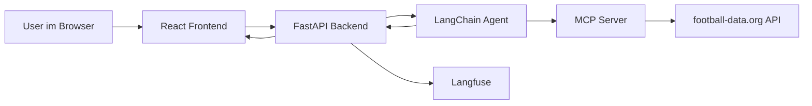

OST FS26  
Kaan Kayali und Stan Johler  
FS26 | 05. Juni 2026  
Dozent: Marcel Amsler

# BetRegret

BetRegret ist ein Fussball-Chatbot, der Fragen zu Teams, Ligen, Fixtures, Live-Spielen und Wettprognosen beantwortet.

## Ziel des Projekts

Das Ziel ist ein Fussball-Assistent, der möglichst nah an echten Daten arbeitet und nicht einfach freie Antworten erfindet. Der Bot soll:

- Fussballfragen mit aktuellen Daten beantworten
- Informationen zu Teams, Ligen und Spielen finden
- Vorhersagen auf Basis nachvollziehbarer Signale berechnen
- bei Unsicherheit sagen, warum eine Frage nicht sauber mit den vorhandenen Tools beantwortbar ist
- den gesamten Chatverlauf für Folgefragen behalten
- den Weg von der Nutzerfrage bis zur Antwort nachvollziehbar machen

## Gesamtidee und Architektur



Der Ablauf ist:

1. Der User schreibt eine Nachricht im Frontend.
2. Das Frontend sendet den kompletten Chatverlauf an das Backend.
3. Das Backend wandelt den Verlauf in LangChain-Messages um.
4. Der Agent entscheidet, welches Tool er braucht.
5. Der MCP-Server spricht mit der football-data.org API.
6. Die Antwort aus dem Tool geht zurück an den Agenten.
7. Der Agent formuliert daraus die Antwort.
8. Das Backend hängt die Laufzeit an und gibt die Antwort an das Frontend zurück.

Langfuse zeichnet dabei die Agentenläufe und Tool-Nutzung auf.

## Wie die Komponenten zusammenarbeiten

Das Projekt hat drei klare Ebenen:

- das Frontend
- das Backend
- den MCP-Server für die eigentlichen Fussballdaten

## Frontend

`App.js` verwaltet:

- den Chatverlauf
- das Eingabefeld
- den Ladezustand
- den Request an das Backend

Bei jeder neuen Nachricht wird der bisherige Verlauf mitgeschickt. Dadurch kann der Bot Folgefragen im Kontext verstehen.

`Chatview.jsx` zeigt die Nachrichten an.

`Chatfield.jsx` stellt das Eingabefeld und den Send-Button bereit.

`AIMessage.jsx` rendert die Modellantworten und unterstützt einfache Formatierungen wie Zeilenumbrüche, Listen, Bilder und Hervorhebungen.

`MessageLoader.jsx` zeigt den Ladezustand. Das Fussballsymbol ist lokal gespeichert unter `frontend/src/assets/football.png` und wird nicht extern geladen.

## Backend

Wichtige Datei: `backend/main.py`

### Aufgaben von `main.py`

`main.py`:

- startet FastAPI
- baut den LangChain-Agenten
- bindet den MCP-Server über `MultiServerMCPClient` ein
- akzeptiert den Chatverlauf als Request
- ruft den Agenten auf
- hängt die Antwortzeit an
- sendet Langfuse-Callbacks
- fängt Kontext-Overflow ab
- prüft tool-freie Antworten mit einem Guard

Der Agent ist so konfiguriert, dass er die Tools zuerst nutzen soll. Erst wenn die Tools keine Antwort liefern können, darf er auf internes Fussballwissen ausweichen.

## MCP-Server und football-data.org

Der MCP-Server liegt in `backend/soccer-mcp-server/soccer_server.py`.

Er kapselt die football-data.org API und stellt dem Agenten klar benannte Tools bereit. Der Agent spricht nicht direkt mit der API, sondern nur mit dem MCP-Server. Das macht das System sauberer und kontrollierbarer.

### Anpassungen am MCP-Server

Um die Integration mit der football-data.org API zu ermöglichen, wurden mehrere Aspekte des MCP-Servers angepasst und erweitert:

- neue Endpunkte
- neue Datenstrukturen
- die Logik für `season`
- Teamnamens-Normalisierung
- Fehler- und Rate-Limit-Verhalten
- Vorhersagelogik

### Teamnamen normalisieren

Der Benutzer schreibt Teamnamen oft anders als die API es versteht. Darum normalisiert der Server Namen, entfernt Sonderzeichen und gleiche Bedeutungstragende Kürzel. So werden zum Beispiel verschiedene Schreibweisen besser zusammengeführt.

### Retry und Rate Limits

Der Server reagiert robuster auf API-Fehler und Rate Limits. Bei 429-Antworten wird erneut versucht, statt sofort aufzugeben.

### Cache

Im MCP-Server gibt es mehrere In-Memory-Caches:

- `TEAM_SEARCH_CACHE`
- `COMPETITIONS_CACHE`
- `TEAM_ID_CACHE`
- `TEAM_FULL_DATA_CACHE`
- `STANDINGS_DATA_CACHE`

Der Cache spart Zeit, weil wiederholte API-Aufrufe innerhalb derselben Server-Session vermieden werden. Er lebt nur im Speicher und ist nach einem Neustart der Website leer.

## Das Wettentool

Die Funktion `predict_match_outcome` in `backend/soccer-mcp-server/soccer_server.py` bewertet ein Spiel zwischen zwei Teams.

Das Tool liefert:

- ein erwartetes Ergebnis
- Wahrscheinlichkeiten für Heimsieg, Unentschieden und Auswärtssieg
- eine Empfehlung
- eine nachvollziehbare Analyse

Die Vorhersage nutzt diese Signale:

- aktuelle Ligadaten aus der Tabelle
- Punkte pro Spiel
- Tordifferenz
- Tore für und gegen
- Heimvorteil

Das Ergebnis ist bewusst einfach gehalten. Es soll keine Blackbox sein, sondern eine kompakte Einschätzung, die der Chatbot direkt erklären kann.

## Guard, Sicherheit und Fehlertoleranz

BetRegret soll möglichst toolbasiert arbeiten. Gleichzeitig braucht das System Schutz, wenn die Tools für eine Frage nicht ausreichen und die AI auf ihr internes Wissen zurückgreift. Dafür gibt es ein LLM-as-a-Guard, welches die Antwort der AI überprüft, ob sie Fussball-relevant ist. So wird verhindert, dass der User die AI jailbreaken kann.

### Kontext-Overflow

Wenn eine Frage zu viele Tokens verwendet, fängt das Backend den Fehler ab und gibt eine erklärende Antwort zurück statt eines Serverfehlers. Der Bot sagt dann, dass die Anfrage zu gross für den Modellkontext ist, und nennt sinnvollere Alternativen.

## Langfuse

Langfuse ist im Backend eingebunden, um die Agentenläufe zu beobachten.

## LLM, Modelle und Umgebungsvariablen

Das Backend nutzt:

- `gpt-4o` als primäres Agentenmodell
- `gpt-4o-mini` als Guard-Modell zur Überprüfung tool-freier Antworten

Der Agent versucht zuerst, Tools zu verwenden. Falls die Tools nicht ausreichen, kann er auf internes Fussballwissen zurückgreifen. Der Guard prüft dann, ob diese Antwort weiterhin football-relevant ist.

Damit alles startet, muss eine `.env`-Datei existieren. Das Projekt hat aktuell keine solche Datei im Repository, daher muss sie manuell angelegt werden.

Die wichtigen Variablen sind:

```env
OPENAI_API_KEY="openai-key"
FOOTBALL_DATA_API_KEY="football-data-key"
```

## Team Workflow

BetRegret wurde im Team entwickelt. Wir arbeiten mit separaten Feature-Branches und Bugfix-Branches, prüfen Änderungen per Review und mergen erst in `main`, wenn der Code stabil und getestet ist. Dieser Branch-basierte Workflow hilft, parallel zu entwickeln und Konflikte kontrolliert zu lösen.


## Tests & Evaluation

Das Projekt verfügt über automatisierte Tests zur Qualitätssicherung sowie über ein Evaluationsskript.

### 1. Unit-Tests
Die Unit-Tests befinden sich im Verzeichnis `backend/tests/`.
Zusätzlich zu den grundlegenden Funktionalitäten wurden Tests für Edge-Cases und Fehlerfälle hinzugefügt:
* **API-Rate-Limiting (`test_fetch_json_rate_limit_retry`):** Verifiziert, dass der Server bei einem HTTP 429 Rate Limit wartet und die Anfrage erfolgreich wiederholt.
* **Saisonstart (`test_predict_match_outcome_zero_games_played`):** Verhindert Division-by-Zero-Fehler, falls zwei Teams zu Beginn einer neuen Saison noch 0 Spiele absolviert haben.

**Ausführung:**
Im Ordner `backend/` ausführen:
```bash
uv run pytest
```

### 2. RAG- & Agenten-Evaluation (Ragas)
Da BetRegret ein tool-basierter Agent (Agentic RAG) ist, wird die Qualität der Antworten und Datenabfragen mithilfe des **Ragas**-Frameworks evaluiert.

Das Skript `backend/eval_bot.py` führt vordefinierte Testanfragen aus (darunter reguläre Fussballfragen sowie Edge-Cases wie Off-Topic-Eingaben) und bewertet diese anhand von zwei primären Ragas-Metriken:
* **Faithfulness (Glaubwürdigkeit):** Misst, ob der Agent Halluzinationen erzeugt oder sich strikt an die aus den Tools abgerufenen API-Daten hält.
* **Answer Relevancy (Antwort-Relevanz):** Misst, wie präzise der Agent auf die Frage des Nutzers eingeht.

Zusätzlich wird für jede Anfrage die **Antwortzeit (Latenz)** erfasst. Die Durchschnittswerte werden in der Konsole ausgegeben und detaillierte Einzelergebnisse in `bot_evaluation_results.csv` exportiert.

**Ausführung:**
Im Ordner `backend/` ausführen:
```bash
uv run eval_bot.py
```


## Bekannte Probleme und technische Erkenntnisse

Die wichtigsten Probleme im Projekt sind:

- `predict_match_outcome` hängt vollständig von Liga-Tabellendaten ab. Wenn für ein Team wie `Inter Milan` keine aktuellen Ligastatistiken verfügbar sind, kann die Vorhersage nicht berechnet werden.
- Der MCP-Server hat mehrere hart kodierte `time.sleep(20)`-Pausen bei der Team-Suche und bei Standings-Abfragen. Das macht die Tool-Ausführung deutlich langsamer.
- Es gibt keinen robusten Fallback für Teams ohne Tabellenplatz oder fehlende `TOTAL`-Standing-Daten.

### Warum die Tool-Verwendung länger dauert

Die Verzögerung kommt nicht primär vom LLM, sondern von der API-Abfragestrategie im MCP-Server:

- vor einer Team-Suche wird 20 Sekunden gewartet,
- vor einem Teamdaten-Request weitere 20 Sekunden,
- vor einem Standings-Request nochmal 20 Sekunden,
- zusätzlich gibt es Retry-Logik bei 429- oder Serverfehlern.

Diese Schritte sind als Schutz gegen API-Limits gedacht, führen aber zu hoher Latenz bei Echtzeit-Anfragen.

## Ausführung und Setup

### Backend starten

Im Ordner `backend/`:

```bash
uv sync
uv run main.py
```

### Frontend starten

Im Ordner `frontend/`:

```bash
npm install
npm run start
```

### Benötigte Umgebungsvariablen

```env
OPENAI_API_KEY="openai-key"
FOOTBALL_DATA_API_KEY="football-data-key"
```

## Fazit

BetRegret erfüllt das gesetzte Ziel: Ein Fussball-Chatbot, der auf echten Daten basiert, nachvollziehbare Vorhersagen macht und nicht einfach halluziniert. Die Kombination aus LangChain-Agent, MCP-Server und football-data.org API funktioniert grundsätzlich gut. Der Guard-Mechanismus schützt das System vor missbräuchlicher Nutzung, und Langfuse gibt wertvolle Einblicke in das Verhalten des Agenten.

Die grösste technische Einschränkung ist die Latenz durch die hart kodierten Wartezeiten im MCP-Server. Für einen produktiven Einsatz müsste hier eine dynamischere Rate-Limit-Strategie implementiert werden. Auch die Vorhersagelogik ist bewusst einfach gehalten — sie liefert plausible Ergebnisse, kann aber keine komplexen Faktoren wie Verletzungen oder Formkurven einzelner Spieler berücksichtigen.

## Reflexion

Das Projekt hat uns gezeigt, wie viel Aufwand in der Integration externer APIs steckt. Die football-data.org API hat eigene Datenstrukturen und Rate-Limits, die wir erst verstehen und umgehen mussten, bevor wir uns auf die eigentliche Chatbot-Logik konzentrieren konnten.

Die Entscheidung, einen MCP-Server als Zwischenschicht einzuführen, war rückblickend richtig. Sie macht das System modularer und leichter testbar. Gleichzeitig hat sie den Entwicklungsaufwand erhöht, weil wir zwei Systeme parallel pflegen mussten.

Was wir anders machen würden:

- Die `time.sleep()`-Pausen von Anfang an durch eine sauberere Rate-Limit-Logik ersetzen
- Integrationstests früher einführen, nicht erst am Schluss
- Die `.env`-Datei mit einem Beispiel (`.env.example`) im Repository ablegen, damit der Einstieg einfacher ist

Insgesamt war BetRegret ein lehrreiches Projekt, das zeigt, wie LLM-basierte Systeme mit echten Datenquellen verknüpft werden können — mit allen Herausforderungen, die das in der Praxis mit sich bringt.
